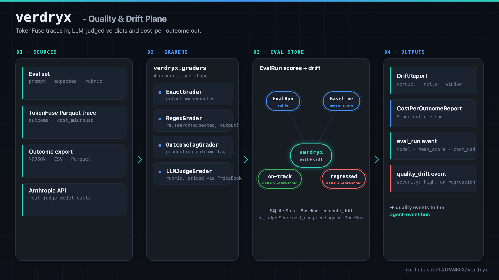
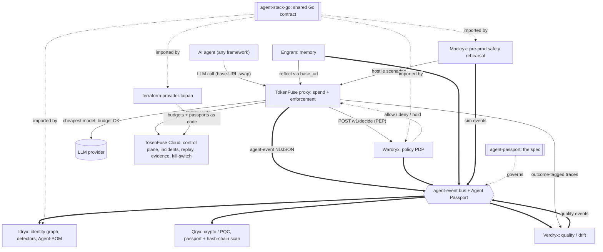
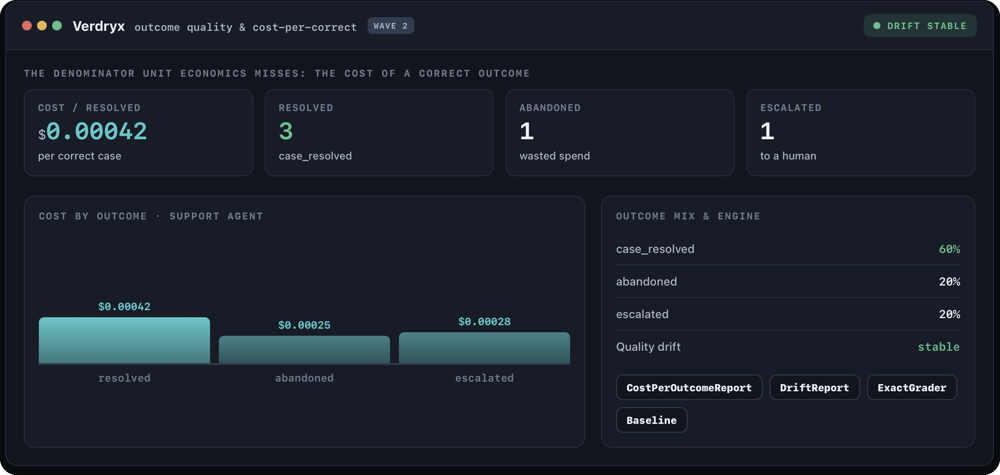
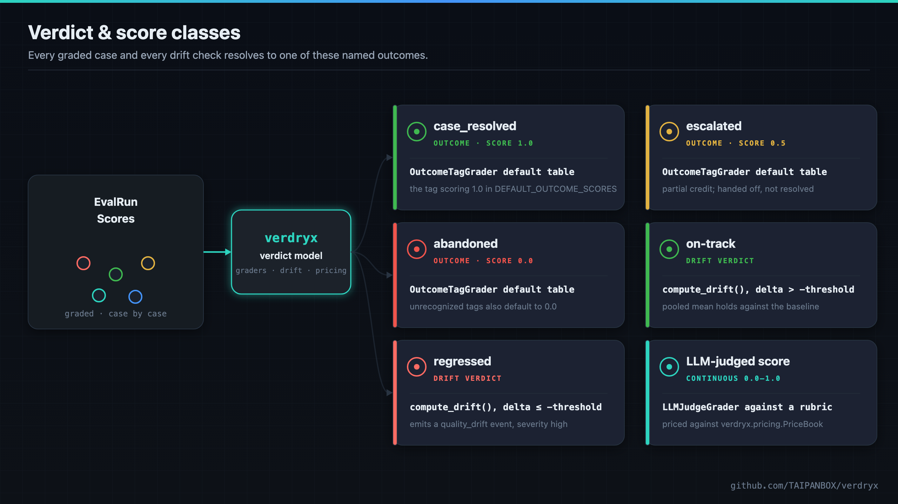
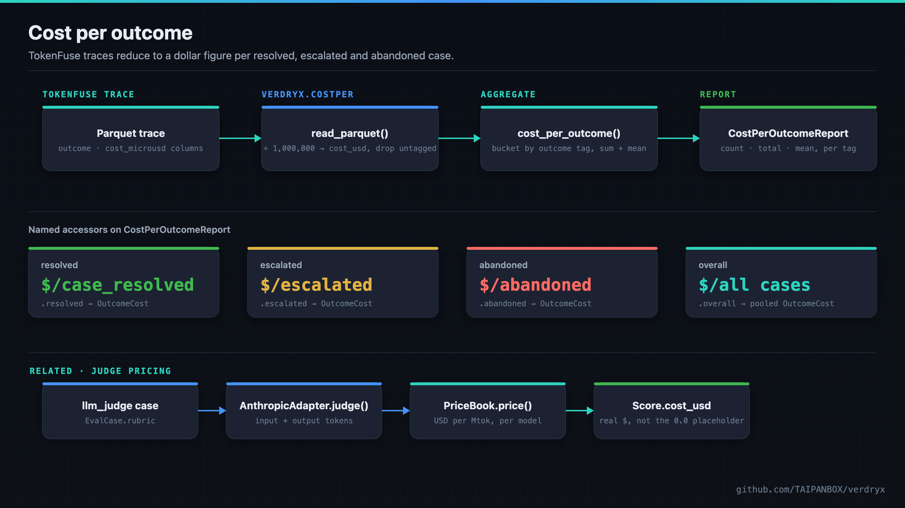

<div align="center">

# verdryx - Quality & Drift Plane

**Grade an agent's outputs against an eval set or a production outcome tag, then catch when quality drifts.**

[](https://github.com/TAIPANBOX/verdryx/actions/workflows/ci.yml)


-success.svg)



</div>

**Verdryx measures whether an operator's own agents did their job correctly.
It never manipulates outputs, never crafts adversarial prompts, and never
attacks anything.** Given an eval set, it grades a model's outputs against
expected values, regex patterns, recorded production outcome tags, or an
LLM-judged rubric, stores the results, and tells you when quality has
drifted against a baseline you set. A companion tool turns TokenFuse's
outcome-tagged Parquet traces into a real dollar figure per resolved,
escalated and abandoned case. This is entirely defensive, self-measurement
tooling for the operator running the agents, not a red-teaming or
offensive-security tool.

---

## Where this fits in the stack

Verdryx is the quality plane of the TAIPANBOX agent-governance stack: it grades an agent's outputs and tells you when quality has drifted against a baseline.



- **Consumes**: outcome-tagged traces and records exported by **TokenFuse** (via `tokenfuse outcomes --json` or Parquet traces).
- **Produces**: cost-per-correct metrics, quality scores, drift reports, and `source: verdryx` events.
- **Talks to**: **TokenFuse** (its LLM judge can route through TokenFuse via `base_url`, and TokenFuse is the source of the traces Verdryx scores).

The full stack is TokenFuse (spend), Wardryx (policy), Engram (memory), Idryx (access), Qryx (crypto), Verdryx (quality), Mockryx (pre-prod), on the shared Agent Passport + agent-event contract (agent-stack-go / agent-passport), configured via terraform-provider-taipan.

Run the whole open stack locally with one command via [**stack-up**](https://github.com/TAIPANBOX/stack-up); the stack's home on the web is [**it-rat.com**](https://it-rat.com).

## Live infrastructure validation

Before any public launch, Verdryx computed cost-per-outcome from real Parquet traces produced by a live,
Claude-backed multi-agent run: a correctly resolved case cost $0.00042, while an abandoned attempt still
cost $0.00025 for nothing - the gap a dollar total alone can't show.



Full write-up and all numbers: [`VALIDATION.md`](VALIDATION.md).

---

## What it does

Verdryx is a pipeline: **eval set / traces → graders → eval store → drift +
cost-per-outcome + events** (the diagram at the top). Every grader produces
the same `Score` shape, so the eval runner dispatches to whichever a case
asks for without special-casing.

| Stage | What it covers |
|---|---|
| **Eval runner** | `verdryx.cli.run_eval` / `verdryx eval`: loads an `EvalSet` (a list of `EvalCase` prompts), calls a model for each case, grades the output, and stores the result as an `EvalRun` of per-case `Score`s in a local SQLite file |
| **Five graders** | `verdryx/graders.py`: exact match, regex match, a `tokenfuse x-fuse-outcome` tag lookup, an LLM-judged rubric, and tool-call accuracy (which tools, in what order) |
| **Baselines and drift** | `verdryx/drift.py`: snapshot an `EvalRun`'s mean score as a `Baseline`, then compare a window of later runs against it |
| **Cost per outcome** | `verdryx/costper.py`: given a flat export of `{outcome, cost_usd}` records, computes cost-per-resolved-case, cost-per-escalated, cost-per-abandoned, and overall |
| **Opt-in event log** | `verdryx/events.py`: an NDJSON writer for the shared TAIPANBOX Agent Passport event envelope (schema `taipanbox.dev/agent-event/v0.2`, `source: "verdryx"`), so `eval_run`, `quality_score`, and `quality_drift` events reach the rest of the governance stack |
| **Opt-in OTLP export** | `verdryx/otel.py`: a hand-rolled OTLP/HTTP-JSON span per `eval`/`drift` run to `VERDRYX_OTLP_ENDPOINT`, so a trace collector (Grafana/Datadog/Honeycomb) sees eval/drift activity regardless of verdict |

---

## Graders and verdict classes

<div align="center">

</div>

Every case resolves to a `Score` in `[0.0, 1.0]`; every drift check resolves
to one of two named verdicts. Four graders share one shape (`grade()` on an
`EvalCase`), so `verdryx eval` dispatches to whichever a case asks for; a
fifth, `ToolTraceGrader`, is dispatched differently since it scores a tool
trace rather than free text (see
[Tool-call accuracy](#tool-call-accuracy-tool_trace) below):

| Grader | `case.expected` / `case.rubric` | Scores 1.0 when |
|---|---|---|
| `ExactGrader` | `expected`: literal string | `output == expected` |
| `RegexGrader` | `expected`: a regex pattern | `re.search(expected, output)` matches |
| `OutcomeTagGrader` | none (reads `output` itself) | `output` is a tag mapped to `1.0` in its table |
| `LLMJudgeGrader` | `rubric`: grading instructions | the injected judge scores the rubric that high |
| `ToolTraceGrader` | `tools` / `expected_tools`: see below | the model's ordered tool calls exactly match `expected_tools` |

`OutcomeTagGrader`'s default table is `{"case_resolved": 1.0, "escalated":
0.5, "abandoned": 0.0}` (`verdryx.DEFAULT_OUTCOME_SCORES`), fully overridable
via its `mapping` constructor argument. An unrecognized tag scores `0.0` by
default rather than raising.

`LLMJudgeGrader` takes an injected adapter satisfying the `LLMAdapter`
protocol (`complete()` + `judge()`). Two are provided:

- `StubLLMAdapter`: deterministic, records every call, no network. This is
  what Verdryx's own tests use, and what `--model stub` selects on the CLI.
- `AnthropicAdapter`: the real adapter, backed by the Anthropic Messages
  API. Its constructor mirrors the `AnthropicAdapter` seam in
  [Engram](https://github.com/TAIPANBOX/engram) (`engram/llm.py`): `model`,
  `base_url`, and `api_key` are accepted the same way, and `base_url` lets
  judge/completion calls route through a proxy (e.g. TokenFuse) instead of
  hitting Anthropic directly. Its `judge()` calls also price themselves
  against `verdryx.pricing.PriceBook` (a Python port of TokenFuse's own
  default price book), so an `llm_judge` case's `Score.cost_usd` is a real
  dollar figure, not the `0.0` placeholder the other three graders leave in
  place (they make no model call, so there is nothing to price).

The candidate output a judge grades is wrapped in an `<output>` tag with an
instruction to treat it as inert data, the same delimited-block technique
Engram uses for episodic content: grading untrusted agent output is exactly
the kind of place a prompt injection would try to hijack the grader, so the
judge prompt is built defensively even though Verdryx itself never acts on
what it reads.

**Drift** (`compute_drift(recent_runs, baseline, threshold=0.05)`) pools
every case score across a window of the most recent eval runs into one mean
(not a mean of each run's own mean, which would distort unevenly-sized
runs), then compares that pooled mean to `baseline.mean_score`:

- `delta = mean_score - baseline.mean_score`
- `verdict = "regressed"` if `delta <= -threshold`, else `"on-track"`

That flat threshold is always sufficient on its own to trip the verdict, and
never goes away. When the caller also passes `baseline_run` (the baseline's
original `EvalRun`, with its per-case scores), `compute_drift` additionally
runs a two-sample significance check between those scores and the recent
pooled ones: a Welch's t-statistic (informational) plus a bootstrap
confidence interval on the delta. If that interval's upper bound stays below
zero, the verdict is `"regressed"` too, even when the drop is smaller than
`threshold` -- catching a small but consistent regression a flat threshold
sized to filter noise would otherwise miss.

`verdryx drift --baseline ID --window N` fetches the baseline, filters
stored runs to the same model, takes the `N` most recent, and prints the
report -- including the t-statistic and confidence interval whenever the
baseline run has at least two scores to compare against (it already loads
that run to filter by model, so this is free). On `regressed`, and only
then, it emits a `quality_drift` event (severity `high`) if an event log is
configured; `on-track` checks are not reported as events.

---

## Tool-call accuracy (tool_trace)

A fifth grader, `ToolTraceGrader`, scores WHICH tools a model chose and IN
WHAT ORDER, straight from the model's own `tool_use` content blocks. Verdryx
already calls the model under evaluation for every non-`outcome_tag` case
(via `LLMAdapter`); a `tool_trace` case sends the same prompt with a `tools`
array attached and grades what the model chose to call, in the order it
chose to call them.

```json
{
  "id": "support-tier1-tools-v1",
  "cases": [
    {
      "id": "refund-flow-tools",
      "prompt": "The customer's order #4471 arrived damaged. Handle it.",
      "grader": "tool_trace",
      "tools": [
        {
          "name": "lookup_order",
          "description": "Look up an order by id",
          "input_schema": {
            "type": "object",
            "properties": { "order_id": { "type": "string" } },
            "required": ["order_id"]
          }
        },
        {
          "name": "issue_refund",
          "description": "Issue a refund for an order",
          "input_schema": {
            "type": "object",
            "properties": { "order_id": { "type": "string" } },
            "required": ["order_id"]
          }
        }
      ],
      "expected_tools": ["lookup_order", "issue_refund"]
    }
  ]
}
```

`tools` is a small array of provider-shape tool definitions (the Anthropic
Messages API's own `tools` shape), passed to the adapter verbatim -- Verdryx
does not reinterpret or validate the schema inside it. `expected_tools` is
the ordered list of tool NAMES a correct response should call; an empty
list (`"expected_tools": []`) is legal and means the model is expected to
call no tools at all for that case.

### How scoring works

`ToolTraceGrader.grade_trace()` compares the model's own ordered tool names
against `expected_tools`:

- **Exact ordered match** -- including both lists being empty, meaning the
  model correctly called no tools -- scores `1.0`.
- **Otherwise**, the score is the length of the longest common subsequence
  (LCS) between the two ordered lists, divided by the longer list's length,
  a value in `[0, 1)`. A swapped order, an extra call, or a missing call
  each cost credit smoothly instead of the case scoring `0.0` outright; a
  completely disjoint trace still lands at `0.0`.

### Single-turn, no execution, by design

Verdryx grades the model's **first response's** tool selection and order,
nothing more. It never executes a tool, never sends a `tool_result` back,
and never continues the conversation to a second turn. Verdryx does not
call tools itself and does not become an agent runtime -- it is, and will
stay, a grader that reads what the model chose to call.

### Why this grader runs live, not from stored traces

Every other Verdryx grader can, in principle, be pointed at data someone
already recorded. `tool_trace` cannot: TokenFuse's own Parquet traces record
only a tool-call **count** per call (see `tokenfuse`'s `docs/21` trace
schema), never the tool **names** or their **order** -- there is nothing in
a stored trace for this grader to read. Scoring tool selection and order
therefore requires calling the model under evaluation directly, via
`LLMAdapter.complete_with_tools()`, once per case, rather than reading it
back out of TokenFuse afterward.

### Drift and baselines work on this unchanged

`ToolTraceGrader.grade_trace()` returns a plain `GradeResult`, folded into
the same `Score` shape by `verdryx.cli.run_eval` as every other grader.
`compute_drift` and `verdryx baseline`/`verdryx drift` never look at grader
kind, only at `Score.value`, so a baseline set from a `tool_trace` run and a
later drift check against it work with no extra plumbing at all. In
practice this means tool-selection drift -- a model quietly starts skipping
a step, or reordering two calls -- shows up in `verdryx drift` the same way
any other quality regression does: tool-selection drift detection for free.

---

## Cost per outcome

<div align="center">

</div>

`cost_per_outcome(records)` takes an iterable of `{"outcome": str,
"cost_usd": float}` mappings and returns a `CostPerOutcomeReport`: one
`OutcomeCost` (count, total, mean) per outcome tag that appears in the
input, plus an `overall` row pooling everything.

| Accessor | Returns |
|---|---|
| `.resolved` | `OutcomeCost` for `case_resolved`, or `None` if absent |
| `.escalated` | `OutcomeCost` for `escalated`, or `None` if absent |
| `.abandoned` | `OutcomeCost` for `abandoned`, or `None` if absent |
| `.get(tag)` | `OutcomeCost` for any custom tag |
| `.overall` | `OutcomeCost` pooling every record regardless of tag |

`load_records(path)` reads `.ndjson`/`.jsonl`, `.csv`, a single `.parquet`
file, or a directory of `.parquet` files, and dispatches automatically;
`verdryx cost-per-correct --input <path>` (file) or `--traces <dir>`
(directory of tokenfuse Parquet segments, e.g. `TOKENFUSE_DATA_DIR`) wraps
all of them in one CLI command.

`read_parquet` (requires the `traces` extra: `pip install -e '.[traces]'`)
reads tokenfuse's `outcome`, `cost_microusd`, `run_id`, `step`, and
`decision` trace columns directly (`tokenfuse`'s `crates/gateway/src/sink.rs`),
converting microdollars to `cost_usd`, and reduces a `run_id`-bearing trace
the same way tokenfuse-core does it
(`crates/core/src/outcomes.rs`'s `compute_outcomes`):

- Rows are ordered by `(run_id, step)`; the last non-empty outcome tag per
  run wins (`_reduce_call_rows`).
- Every call belonging to a run folds into that run's bucket, not only its
  tagged calls -- an untagged intermediate call's cost is not dropped, and
  a run that is never tagged at all still produces a record, under the
  `UNTAGGED` (`"(untagged)"`) label, rather than vanishing from the report.
- A Breaker-blocked call (`decision` one of tokenfuse's seven block
  reasons, mirroring `is_blocked_decision()`) is still counted, but
  excluded from cost -- its `cost_microusd` is an avoided estimate, never a
  real settled charge.

Rows with no `run_id` column at all are kept as independent per-call
records, for backward compatibility with trace files that predate it: an
untagged row then has no run to fold into and is dropped, same as before
this reduction existed.

---

## Eval set format

A JSON file with an `id` and a list of `cases`:

```json
{
  "id": "support-tier1-v1",
  "cases": [
    {
      "id": "greets-politely",
      "prompt": "Reply to: 'my order is late'",
      "expected": "sorry",
      "grader": "regex"
    },
    {
      "id": "resolves-refund",
      "prompt": "Draft a refund confirmation for order #4471",
      "rubric": "Confirms the refund amount and a realistic timeline.",
      "grader": "llm_judge"
    },
    {
      "id": "run-8842-outcome",
      "prompt": "case_resolved",
      "grader": "outcome_tag"
    }
  ]
}
```

`id` must be stable across runs of the same eval set (it is not
auto-generated): Scores are compared case-by-case over time, so a case's id
needs to mean the same thing on every run. `grader` is one of `exact`
(default), `regex`, `outcome_tag`, or `llm_judge`. For `outcome_tag` cases,
`prompt` holds the outcome tag itself, since there is nothing to send a
model when grading an already-recorded production outcome.

---

## Events

Disabled by default. Set `VERDRYX_EVENTS_PATH` or pass `--events <path>` to
`eval`/`drift` to turn it on. Every event follows the shared TAIPANBOX
Agent Passport envelope (`taipanbox.dev/agent-event/v0.2`, see the
`agent-passport` repo's `SPEC.md`):

| `type` | severity | `data` |
|---|---|---|
| `eval_run` | info | `model`, `cases`, `mean_score`, `total_tokens`, `total_cost_usd` |
| `quality_score` | info | `case_id`, `value`, `tokens`, `cost_usd` |
| `quality_drift` | high | `baseline_id`, `window`, `mean_score`, `delta`, `verdict`, `baseline_n`, `t_statistic`, `ci_low`, `ci_high` |

Same rules as Engram's exporter: **opt-in** (no file, no thread, no
allocation unless a path is configured), **fail-open** (a write failure is
logged and swallowed, never raised into the caller's eval/drift call), and
an event is **skipped** (counted in `EventLog.skipped_empty_agent_id`)
whenever `agent_id` is empty; Verdryx never fabricates one. Pass
`--agent-id agent://your-org.example/...` to `eval`/`drift` to identify
which agent's output is being measured.

---

## OTLP export

Disabled by default. Set `VERDRYX_OTLP_ENDPOINT` to a collector base URL
(e.g. `http://localhost:4318`) to turn it on. `eval` and `drift` each
export one OTLP/HTTP-JSON span, posted to `<endpoint>/v1/traces`, hand-
rolled against the wire format directly (`verdryx/otel.py`, stdlib
`urllib` only -- no OpenTelemetry SDK dependency), mirroring Wardryx's own
exporter. Every span for one eval run shares a trace id derived from its
`run_id`, so an `eval_run` span and a later `quality_drift` check against
the same run group together in the collector's UI.

Unlike the NDJSON event log above, a span is exported for **every**
`eval`/`drift` run regardless of verdict -- tracing is for observability of
what ran and when, not governance alerting, so an unremarkable "on-track"
drift check is exactly as trace-worthy as a regression.

Verdryx's `eval`/`drift` commands are one-shot CLI invocations, not a
long-lived server the way Wardryx is: the process exits as soon as the
command handler returns, and a fire-and-forget background thread does not
survive its process exiting. `OTLPExporter.wait()` joins any in-flight
export before the command handler returns, so the process's own printed
output is never delayed, but the process itself does not exit until
delivery has been attempted -- without it, a span would be silently killed
mid-POST essentially every time, a real bug a live end-to-end CLI run
against an actual local collector caught (not just a theoretical concern).

---

## Configuration

Read once, at process start, into `verdryx.config.Config`:

| Variable | Meaning |
|---|---|
| `VERDRYX_DB` | SQLite store path, honoured verbatim (see the resolution order below) |
| `TAIPAN_HOME` | The installed stack's home (default: `~/.taipan`), used to place the store when the stack is installed |
| `VERDRYX_EVENTS_PATH` | Default NDJSON event log path (default: unset, events disabled) |
| `VERDRYX_OTLP_ENDPOINT` | OTLP/HTTP collector base URL; one span per `eval`/`drift` run (default: unset, OTLP export disabled) |
| `ANTHROPIC_API_KEY` | API key for the real `AnthropicAdapter` |
| `ANTHROPIC_BASE_URL` | Proxy endpoint (e.g. TokenFuse) for the real `AnthropicAdapter` |

CLI flags (`--db`, `--events`) always take precedence over the environment.

### Where the store ends up

Most explicit candidate first:

1. `--db <path>`
2. `VERDRYX_DB`, honoured even if the path does not exist yet, so an explicit
   override fails on the path you named rather than silently redirecting to a
   different store
3. `<TAIPAN_HOME>/verdryx.db` (default `~/.taipan/verdryx.db`), but only when
   that directory already exists, i.e. only when the stack is installed
4. `./verdryx.db`, relative to the current working directory

Candidate 3 exists because Verdryx has no server: this SQLite file *is* its
machine-readable surface, and other tools read it directly, the Genaryx
console among them. Writing to the working directory while readers look in
the installed home does not lose results, it hides them.

Nothing here creates a directory as a side effect. If the stack is not
installed, the historical `./verdryx.db` behaviour is unchanged.

The file carries its schema version in SQLite's `PRAGMA user_version`. A
store stamped newer than the running build understands is refused on open
rather than read with the wrong assumptions.

---

## Install

System Python is often externally managed (PEP 668); use a virtual
environment.

```bash
git clone https://github.com/TAIPANBOX/verdryx
cd verdryx
python -m venv .venv && source .venv/bin/activate
pip install -e .
```

For the real LLM-judge adapter (`AnthropicAdapter`), add the `anthropic`
extra. For reading tokenfuse Parquet traces directly (`read_parquet`,
`cost-per-correct --traces`), add the `traces` extra:

```bash
pip install -e '.[anthropic]'
pip install -e '.[traces]'
```

## Quick start

```bash
# Dry run against a deterministic stub model, no network, no API key.
verdryx eval evalset.json --model stub --db verdryx.db

# Snapshot that run as the reference point for future drift checks.
verdryx baseline <run-id-printed-above> --db verdryx.db --label "v1"

# Later, after re-running eval against a new prompt/model version:
verdryx eval evalset.json --model stub --db verdryx.db
verdryx drift --baseline <baseline-id> --db verdryx.db --window 3

# Unit economics from a tokenfuse outcomes export (NDJSON, CSV, or Parquet
# of {"outcome": ..., "cost_usd": ...} records):
verdryx cost-per-correct --input outcomes.ndjson

# ...or straight from a tokenfuse Parquet trace directory (requires the
# traces extra):
verdryx cost-per-correct --traces $TOKENFUSE_DATA_DIR
```

`--model stub` selects a deterministic, network-free adapter, useful for
validating an eval set's structure, and it's exactly what Verdryx's own test
suite uses so CI never makes a real API call. Any other `--model` value is
treated as a real Anthropic model id (requires the `anthropic` extra and
`ANTHROPIC_API_KEY`, or `--events`/`ANTHROPIC_BASE_URL` to route through a
proxy such as TokenFuse).

The same operations are available as a plain Python API:

```python
from verdryx import EvalSet, Store, StubLLMAdapter, compute_drift
from verdryx.cli import run_eval

evalset = EvalSet.load("evalset.json")
run = run_eval(evalset, StubLLMAdapter(), model="stub")

with Store.open("verdryx.db") as store:
    store.save_run(run)
    baseline = store.get_baseline("some-baseline-id")
    if baseline is not None:
        report = compute_drift([run], baseline)
        print(report.verdict)
```

## Development

```bash
python -m venv .venv && source .venv/bin/activate
pip install -e '.[dev,traces]'

pytest              # run the test suite
ruff check .        # lint
ruff format .       # format
```

All eval/judge network calls are behind the injected `LLMAdapter` protocol,
so the test suite runs fully offline against `StubLLMAdapter`. The `traces`
extra is optional: without it, the Parquet-reading tests skip themselves via
`pytest.importorskip` instead of failing.

Verdryx is one plane of the TAIPANBOX agent-governance stack, alongside
[Engram](https://github.com/TAIPANBOX/engram) (memory), TokenFuse (spend
governance), [Idryx](https://github.com/TAIPANBOX/idryx) (identity),
[Qryx](https://github.com/TAIPANBOX/qryx) (cryptographic evidence),
[Wardryx](https://github.com/TAIPANBOX/wardryx) (policy decisions), and
[Mockryx](https://github.com/TAIPANBOX/mockryx) (pre-production safety
rehearsal). Each product is complete alone; the stack shares one identifier format
(`agent://...`) and one event envelope, defined in the
`TAIPANBOX/agent-passport` repo. Verdryx answers one question none of the
others do: did the agent's output actually meet the bar, and is that bar
slipping?

---

## Status

- [x] Eval runner (`verdryx eval`): `EvalSet`/`EvalCase` loader, per-case grading, `EvalRun` persisted to SQLite
- [x] Five graders: `ExactGrader`, `RegexGrader`, `OutcomeTagGrader`, `LLMJudgeGrader`, `ToolTraceGrader`
- [x] Tool-call accuracy (`tool_trace`): single-turn, no-execution grading of a model's own ordered `tool_use` names via `LLMAdapter.complete_with_tools`, exact-match/LCS-partial-credit scoring, drift/baselines work on its scores unchanged
- [x] `StubLLMAdapter` (deterministic, offline, used by CI) and `AnthropicAdapter` (real Messages API, `base_url` proxy support, prompt-injection-resistant judge wrapping)
- [x] Judge call pricing: `verdryx.pricing.PriceBook`, a dependency-free port of TokenFuse's default price book, populates `Score.cost_usd` for `llm_judge` cases
- [x] Baselines and drift: `compute_drift`, flat-threshold `on-track`/`regressed` verdict plus a Welch's-t/bootstrap-CI significance check, `verdryx drift` CLI
- [x] Cost per outcome: `cost_per_outcome`, NDJSON/CSV/Parquet loaders, `verdryx cost-per-correct --input`/`--traces`
- [x] Opt-in NDJSON event log: `eval_run`, `quality_score`, `quality_drift` events on the shared Agent Passport envelope; opt-in, fail-open, empty-`agent_id` events skipped and counted
- [x] Configuration via `verdryx.config.Config`, CLI flags override environment
- [x] Statistically-aware drift verdict (confidence intervals / significance testing) beyond the flat threshold
- [x] Reproduce tokenfuse-core's `compute_outcomes` aggregation inside `read_parquet` (`_reduce_call_rows`): last non-empty outcome tag per run wins (ordered by `run_id`/`step`), every call's cost folds into its run's bucket, a never-tagged run reports under `UNTAGGED`, and a Breaker-blocked call is counted but excluded from cost
- [x] OTLP exporter (`verdryx.otel`): a span per `eval`/`drift` run to `VERDRYX_OTLP_ENDPOINT`, hand-rolled OTLP/HTTP-JSON (stdlib `urllib`, no OTel SDK), mirroring Wardryx's own exporter; unlike a long-lived server, a one-shot CLI process must join its background export thread before exiting (`OTLPExporter.wait`) or the span is silently dropped almost every time -- caught by a live end-to-end run against a real local collector, not just reasoned about

## License

Apache License 2.0. See [LICENSE](LICENSE).
