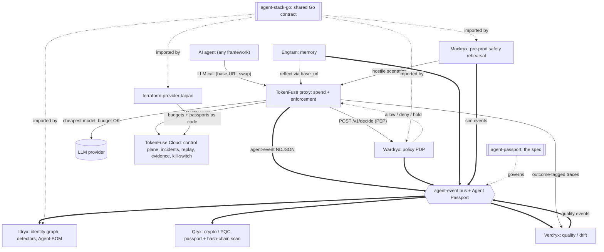

<div align="center">

# verdryx - Quality & Drift Plane

**Grade an agent's outputs against an eval set or a production outcome tag, then catch when quality drifts.**

[](https://github.com/TAIPANBOX/verdryx/actions/workflows/ci.yml)


-success.svg)


</div>

**Verdryx measures whether an operator's own agents did their job correctly.
It never manipulates outputs, never crafts adversarial prompts, and never
attacks anything.** Given an eval set, it grades a model's outputs against
expected values, regex patterns, recorded production outcome tags, or an
LLM-judged rubric, stores the results, and tells you when quality has
drifted against a baseline you set. A companion tool turns TokenFuse's
outcome-tagged Parquet traces into a real dollar figure per resolved,
escalated and abandoned case. This is entirely defensive, self-measurement
tooling for the operator running the agents, not a red-teaming or
offensive-security tool.

---

## Where this fits in the stack

Verdryx is the quality plane of the TAIPANBOX agent-governance stack: it grades an agent's outputs and tells you when quality has drifted against a baseline.



- **Consumes**: outcome-tagged traces and records exported by **TokenFuse** (via `tokenfuse outcomes --json` or Parquet traces).
- **Produces**: cost-per-correct metrics, quality scores, drift reports, and `source: verdryx` events.
- **Talks to**: **TokenFuse** (its LLM judge can route through TokenFuse via `base_url`, and TokenFuse is the source of the traces Verdryx scores).

The full stack is TokenFuse (spend), Wardryx (policy), Engram (memory), Idryx (access), Qryx (crypto), Verdryx (quality), Mockryx (pre-prod), on the shared Agent Passport + agent-event contract (agent-stack-go / agent-passport), configured via terraform-provider-taipan.

---

## What it does

Verdryx is a pipeline: **eval set / traces → graders → eval store → drift +
cost-per-outcome + events** (the diagram at the top). Every grader produces
the same `Score` shape, so the eval runner dispatches to whichever a case
asks for without special-casing.

| Stage | What it covers |
|---|---|
| **Eval runner** | `verdryx.cli.run_eval` / `verdryx eval`: loads an `EvalSet` (a list of `EvalCase` prompts), calls a model for each case, grades the output, and stores the result as an `EvalRun` of per-case `Score`s in a local SQLite file |
| **Four graders** | `verdryx/graders.py`: exact match, regex match, a `tokenfuse x-fuse-outcome` tag lookup, and an LLM-judged rubric |
| **Baselines and drift** | `verdryx/drift.py`: snapshot an `EvalRun`'s mean score as a `Baseline`, then compare a window of later runs against it |
| **Cost per outcome** | `verdryx/costper.py`: given a flat export of `{outcome, cost_usd}` records, computes cost-per-resolved-case, cost-per-escalated, cost-per-abandoned, and overall |
| **Opt-in event log** | `verdryx/events.py`: an NDJSON writer for the shared TAIPANBOX Agent Passport event envelope (schema `taipanbox.dev/agent-event/v0.2`, `source: "verdryx"`), so `eval_run`, `quality_score`, and `quality_drift` events reach the rest of the governance stack |

---

## Graders and verdict classes

<div align="center">

</div>

Every case resolves to a `Score` in `[0.0, 1.0]`; every drift check resolves
to one of two named verdicts. Four graders share one shape (`grade()` on an
`EvalCase`), so `verdryx eval` dispatches to whichever a case asks for:

| Grader | `case.expected` / `case.rubric` | Scores 1.0 when |
|---|---|---|
| `ExactGrader` | `expected`: literal string | `output == expected` |
| `RegexGrader` | `expected`: a regex pattern | `re.search(expected, output)` matches |
| `OutcomeTagGrader` | none (reads `output` itself) | `output` is a tag mapped to `1.0` in its table |
| `LLMJudgeGrader` | `rubric`: grading instructions | the injected judge scores the rubric that high |

`OutcomeTagGrader`'s default table is `{"case_resolved": 1.0, "escalated":
0.5, "abandoned": 0.0}` (`verdryx.DEFAULT_OUTCOME_SCORES`), fully overridable
via its `mapping` constructor argument. An unrecognized tag scores `0.0` by
default rather than raising.

`LLMJudgeGrader` takes an injected adapter satisfying the `LLMAdapter`
protocol (`complete()` + `judge()`). Two are provided:

- `StubLLMAdapter`: deterministic, records every call, no network. This is
  what Verdryx's own tests use, and what `--model stub` selects on the CLI.
- `AnthropicAdapter`: the real adapter, backed by the Anthropic Messages
  API. Its constructor mirrors the `AnthropicAdapter` seam in
  [Engram](https://github.com/TAIPANBOX/engram) (`engram/llm.py`): `model`,
  `base_url`, and `api_key` are accepted the same way, and `base_url` lets
  judge/completion calls route through a proxy (e.g. TokenFuse) instead of
  hitting Anthropic directly. Its `judge()` calls also price themselves
  against `verdryx.pricing.PriceBook` (a Python port of TokenFuse's own
  default price book), so an `llm_judge` case's `Score.cost_usd` is a real
  dollar figure, not the `0.0` placeholder the other three graders leave in
  place (they make no model call, so there is nothing to price).

The candidate output a judge grades is wrapped in an `<output>` tag with an
instruction to treat it as inert data, the same delimited-block technique
Engram uses for episodic content: grading untrusted agent output is exactly
the kind of place a prompt injection would try to hijack the grader, so the
judge prompt is built defensively even though Verdryx itself never acts on
what it reads.

**Drift** (`compute_drift(recent_runs, baseline, threshold=0.05)`) pools
every case score across a window of the most recent eval runs into one mean
(not a mean of each run's own mean, which would distort unevenly-sized
runs), then compares that pooled mean to `baseline.mean_score`:

- `delta = mean_score - baseline.mean_score`
- `verdict = "regressed"` if `delta <= -threshold`, else `"on-track"`

`verdryx drift --baseline ID --window N` fetches the baseline, filters
stored runs to the same model, takes the `N` most recent, and prints the
report. On `regressed`, and only then, it emits a `quality_drift` event
(severity `high`) if an event log is configured; `on-track` checks are not
reported as events. This is a flat threshold, not a significance test: no
p-values or confidence intervals in this MVP. A statistically-aware verdict
is a documented later enhancement.

---

## Cost per outcome

<div align="center">

</div>

`cost_per_outcome(records)` takes an iterable of `{"outcome": str,
"cost_usd": float}` mappings and returns a `CostPerOutcomeReport`: one
`OutcomeCost` (count, total, mean) per outcome tag that appears in the
input, plus an `overall` row pooling everything.

| Accessor | Returns |
|---|---|
| `.resolved` | `OutcomeCost` for `case_resolved`, or `None` if absent |
| `.escalated` | `OutcomeCost` for `escalated`, or `None` if absent |
| `.abandoned` | `OutcomeCost` for `abandoned`, or `None` if absent |
| `.get(tag)` | `OutcomeCost` for any custom tag |
| `.overall` | `OutcomeCost` pooling every record regardless of tag |

`load_records(path)` reads `.ndjson`/`.jsonl`, `.csv`, a single `.parquet`
file, or a directory of `.parquet` files, and dispatches automatically;
`verdryx cost-per-correct --input <path>` (file) or `--traces <dir>`
(directory of tokenfuse Parquet segments, e.g. `TOKENFUSE_DATA_DIR`) wraps
all of them in one CLI command.

`read_parquet` (requires the `traces` extra: `pip install -e '.[traces]'`)
reads tokenfuse's `outcome` and `cost_microusd` trace columns directly
(`tokenfuse`'s `crates/gateway/src/sink.rs`), converting microdollars to
`cost_usd` and dropping untagged rows (most rows in a raw trace: tokenfuse
expects only a run's final call to carry the outcome tag). It does not
reproduce tokenfuse-core's full "last non-empty outcome tag per run wins"
aggregation (`tokenfuse`'s `crates/core/src/outcomes.rs`); that still
happens upstream, e.g. via `tokenfuse outcomes --json`, for a run whose
agent tags more than one of its calls. Reproducing that reduction inside
Verdryx itself remains a documented later enhancement.

---

## Eval set format

A JSON file with an `id` and a list of `cases`:

```json
{
  "id": "support-tier1-v1",
  "cases": [
    {
      "id": "greets-politely",
      "prompt": "Reply to: 'my order is late'",
      "expected": "sorry",
      "grader": "regex"
    },
    {
      "id": "resolves-refund",
      "prompt": "Draft a refund confirmation for order #4471",
      "rubric": "Confirms the refund amount and a realistic timeline.",
      "grader": "llm_judge"
    },
    {
      "id": "run-8842-outcome",
      "prompt": "case_resolved",
      "grader": "outcome_tag"
    }
  ]
}
```

`id` must be stable across runs of the same eval set (it is not
auto-generated): Scores are compared case-by-case over time, so a case's id
needs to mean the same thing on every run. `grader` is one of `exact`
(default), `regex`, `outcome_tag`, or `llm_judge`. For `outcome_tag` cases,
`prompt` holds the outcome tag itself, since there is nothing to send a
model when grading an already-recorded production outcome.

---

## Events

Disabled by default. Set `VERDRYX_EVENTS_PATH` or pass `--events <path>` to
`eval`/`drift` to turn it on. Every event follows the shared TAIPANBOX
Agent Passport envelope (`taipanbox.dev/agent-event/v0.2`, see the
`agent-passport` repo's `SPEC.md`):

| `type` | severity | `data` |
|---|---|---|
| `eval_run` | info | `model`, `cases`, `mean_score`, `total_tokens`, `total_cost_usd` |
| `quality_score` | info | `case_id`, `value`, `tokens`, `cost_usd` |
| `quality_drift` | high | `baseline_id`, `window`, `mean_score`, `delta`, `verdict` |

Same rules as Engram's exporter: **opt-in** (no file, no thread, no
allocation unless a path is configured), **fail-open** (a write failure is
logged and swallowed, never raised into the caller's eval/drift call), and
an event is **skipped** (counted in `EventLog.skipped_empty_agent_id`)
whenever `agent_id` is empty; Verdryx never fabricates one. Pass
`--agent-id agent://your-org.example/...` to `eval`/`drift` to identify
which agent's output is being measured.

---

## Configuration

Read once, at process start, into `verdryx.config.Config`:

| Variable | Meaning |
|---|---|
| `VERDRYX_DB` | Default SQLite store path (default: `verdryx.db`) |
| `VERDRYX_EVENTS_PATH` | Default NDJSON event log path (default: unset, events disabled) |
| `VERDRYX_OTLP_ENDPOINT` | Read into config for a future OTLP exporter; not wired up to anything yet |
| `ANTHROPIC_API_KEY` | API key for the real `AnthropicAdapter` |
| `ANTHROPIC_BASE_URL` | Proxy endpoint (e.g. TokenFuse) for the real `AnthropicAdapter` |

CLI flags (`--db`, `--events`) always take precedence over the environment.

---

## Install

System Python is often externally managed (PEP 668); use a virtual
environment.

```bash
git clone https://github.com/TAIPANBOX/verdryx
cd verdryx
python -m venv .venv && source .venv/bin/activate
pip install -e .
```

For the real LLM-judge adapter (`AnthropicAdapter`), add the `anthropic`
extra. For reading tokenfuse Parquet traces directly (`read_parquet`,
`cost-per-correct --traces`), add the `traces` extra:

```bash
pip install -e '.[anthropic]'
pip install -e '.[traces]'
```

## Quick start

```bash
# Dry run against a deterministic stub model, no network, no API key.
verdryx eval evalset.json --model stub --db verdryx.db

# Snapshot that run as the reference point for future drift checks.
verdryx baseline <run-id-printed-above> --db verdryx.db --label "v1"

# Later, after re-running eval against a new prompt/model version:
verdryx eval evalset.json --model stub --db verdryx.db
verdryx drift --baseline <baseline-id> --db verdryx.db --window 3

# Unit economics from a tokenfuse outcomes export (NDJSON, CSV, or Parquet
# of {"outcome": ..., "cost_usd": ...} records):
verdryx cost-per-correct --input outcomes.ndjson

# ...or straight from a tokenfuse Parquet trace directory (requires the
# traces extra):
verdryx cost-per-correct --traces $TOKENFUSE_DATA_DIR
```

`--model stub` selects a deterministic, network-free adapter, useful for
validating an eval set's structure, and it's exactly what Verdryx's own test
suite uses so CI never makes a real API call. Any other `--model` value is
treated as a real Anthropic model id (requires the `anthropic` extra and
`ANTHROPIC_API_KEY`, or `--events`/`ANTHROPIC_BASE_URL` to route through a
proxy such as TokenFuse).

The same operations are available as a plain Python API:

```python
from verdryx import EvalSet, Store, StubLLMAdapter, compute_drift
from verdryx.cli import run_eval

evalset = EvalSet.load("evalset.json")
run = run_eval(evalset, StubLLMAdapter(), model="stub")

with Store.open("verdryx.db") as store:
    store.save_run(run)
    baseline = store.get_baseline("some-baseline-id")
    if baseline is not None:
        report = compute_drift([run], baseline)
        print(report.verdict)
```

## Development

```bash
python -m venv .venv && source .venv/bin/activate
pip install -e '.[dev,traces]'

pytest              # run the test suite
ruff check .        # lint
ruff format .       # format
```

All eval/judge network calls are behind the injected `LLMAdapter` protocol,
so the test suite runs fully offline against `StubLLMAdapter`. The `traces`
extra is optional: without it, the Parquet-reading tests skip themselves via
`pytest.importorskip` instead of failing.

Verdryx is one plane of the TAIPANBOX agent-governance stack, alongside
[Engram](https://github.com/TAIPANBOX/engram) (memory), TokenFuse (spend
governance), [Idryx](https://github.com/TAIPANBOX/idryx) (identity),
[Qryx](https://github.com/TAIPANBOX/qryx) (cryptographic evidence), and
[Wardryx](https://github.com/TAIPANBOX/wardryx) (policy decisions). Each
product is complete alone; the stack shares one identifier format
(`agent://...`) and one event envelope, defined in the
`TAIPANBOX/agent-passport` repo. Verdryx answers one question none of the
others do: did the agent's output actually meet the bar, and is that bar
slipping?

---

## Status

- [x] Eval runner (`verdryx eval`): `EvalSet`/`EvalCase` loader, per-case grading, `EvalRun` persisted to SQLite
- [x] Four graders: `ExactGrader`, `RegexGrader`, `OutcomeTagGrader`, `LLMJudgeGrader`
- [x] `StubLLMAdapter` (deterministic, offline, used by CI) and `AnthropicAdapter` (real Messages API, `base_url` proxy support, prompt-injection-resistant judge wrapping)
- [x] Judge call pricing: `verdryx.pricing.PriceBook`, a dependency-free port of TokenFuse's default price book, populates `Score.cost_usd` for `llm_judge` cases
- [x] Baselines and drift: `compute_drift`, flat-threshold `on-track`/`regressed` verdict, `verdryx drift` CLI
- [x] Cost per outcome: `cost_per_outcome`, NDJSON/CSV/Parquet loaders, `verdryx cost-per-correct --input`/`--traces`
- [x] Opt-in NDJSON event log: `eval_run`, `quality_score`, `quality_drift` events on the shared Agent Passport envelope; opt-in, fail-open, empty-`agent_id` events skipped and counted
- [x] Configuration via `verdryx.config.Config`, CLI flags override environment
- [ ] Statistically-aware drift verdict (confidence intervals / significance testing) beyond the flat threshold
- [ ] Reproduce tokenfuse-core's "last non-empty outcome tag per run wins" aggregation inside `read_parquet` (currently one record per traced call, not per resolved run)
- [ ] OTLP exporter wired up to `VERDRYX_OTLP_ENDPOINT` (config field exists, nothing consumes it yet)

## License

Apache License 2.0. See [LICENSE](LICENSE).
